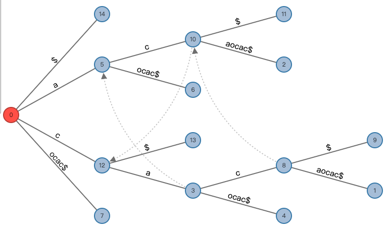

# GeneralizedSuffixTree

An implementation of generalized suffix tree using Ukkonen's algorithm.

**In this page:**

- [The longest common substring problem](#the-longest-common-substring-problem)
- [How it works](#how-it-works)
- [GST versus Dynamic programming](#gst-versus-dynamic-programming)

---

**Inspired by:**

Ukkonen, E. On-line construction of suffix trees. Algorithmica 14, 249–260 (1995).
 
https://www.cs.helsinki.fi/u/ukkonen/SuffixT1withFigs.pdf

---

## The longest common substring problem

Given two or more strings, find the longest substring of these strings. Specifically, the longest common substring of the two strings *"cacaocac"* and *"ccaooc"* is *"cao"*. This seems like such a simple problem, but it still requires a complicated algorithm today.

This repo has implemented an algorithm to solve this problem by constructing a tree called Generalized Suffix Tree (GST). GST is a tree structure which contains sets of suffix strings of the origin string. Usually, the string will be appended a unique character *"$"* for representing "the end", this is to avoid the last node not splitting due to repeated ending characters.

There are 2 algorithms for constructing a GST: **McCreight's algorithm (1976)**, **Ukkonen's algorithm (1995)**. The latter has been implemented here.

The visualized GST of *"cacaocac$"* as follows, made in http://brenden.github.io/ukkonen-animation/ :



## How it works

After cloning this repo, we can get the same result by running these codes in the `Application.py`:

```py
tree = STree()
tree.build_with_automatic_end(["cacaocac"])
print(tree)
```

and something will appear in the console:

```
cacaocac$ ----> ⊥
c ----> cacaocac$
	a ----> a
		c ----> c
			aocac$ (end)
			$ (end)
		ocac$ (end)
	$ (end)
a ----> cacaocac$
	c ----> c
		aocac$ (end)
		$ (end)
	ocac$ (end)
ocac$ (end)
$ (end)
```

`cacaocac$` for root, `⊥` for auxiliary state<sup>\*</sup>, `---->` for suffix link<sup>\*</sup>, and a `[tab]` represents a deeper level in the tree.

> <sup>\*</sup>auxiliary state: The dummy status of the root's suffix link, for convenience in programming.
> [Page 3 of the paper for details]
>
> <sup>\*</sup>suffix link: Used during the construction of a suffix tree.
> [Page 4 of the paper for details]

The method `_update`, `_test_and_split` and `_canonize` of the class `STree` in `STree.py`, are the complete implementation of the procedure of the same name in the page [12] and [13] in the paper, and the method `build` corresponds to the [Algorithm 2.] in the page [14].

But differently, the new `end_idxes` property in the `STree` indicates the indexes of all ending characters *"$"*. It avoids effectively the construction bias of the suffix tree when the string contains or is filled with *"$"* symbols.

So, back to the topic, how does this tree solve the longest common substring problem?

In the `Application.py`, the `lcs2` function find the lcs of two strings. The method `build_with_automatic_end` in the `STree` will concatenate a list of strings with the ending characters *"$"*, and construct a suffix tree. With the help of `end_idxes`, these *"$"* are different and they represent the end of different strings. `STree` will automatically treat these *"$"* as different from other characters, so the character *"$"* itself is just designed for readability of suffix tree printing. The `lcs2` function will traverse the tree and find the deepest non-leaf node that contains the leaf nodes of all string indexes in the string list.

Similarly, it can also be demonstrated using the following codes in `Application.py`

```py
print(lcs2("cacaocac", "ccaooc"))
```

or

```py
print(lcs(["cacaocac", "ccaooc"]))
```

The `lcs` function can find the longest common substring of multiple strings.

The last two commands have the same result:

```
cao
```

## GST versus Dynamic programming

There is always said that the dynamic programming costs , and the Ukkonen's Algorithm just in linear time. So, let's start an experiment.

The code in the `gst_vs_dp.py`, we randomly generated some strings to examine the performance of the two algorithms.

`len` is the length range of the strings, `com_len` is the length range of the common part of the strings.

`len = (800, 1600)` `com_len = (100, 200)`
```
random string has been generated
gst_res: wTE^s>:x,k~%i3pRtdasZ>eLXrU5gbU#ptQF*?$ta,)k~znS*D/Ja:0L}@.X~i~E~{@NsKlK5c#`4v?v.$O]ts&/LNl<m]ww`Z!4G3vPd:@guRfCuz3DSRNHcVu~[r7s8J`X&/uETtiU[$N0p2.$SV2T><WTzqLVm:KkC3uE#2SIj63h?3BZYv;G*bl'PnNYhQ0M
dp_res: wTE^s>:x,k~%i3pRtdasZ>eLXrU5gbU#ptQF*?$ta,)k~znS*D/Ja:0L}@.X~i~E~{@NsKlK5c#`4v?v.$O]ts&/LNl<m]ww`Z!4G3vPd:@guRfCuz3DSRNHcVu~[r7s8J`X&/uETtiU[$N0p2.$SV2T><WTzqLVm:KkC3uE#2SIj63h?3BZYv;G*bl'PnNYhQ0M

gst_time: 12.598991394042969 ms
dp_time: 284.3668460845947 ms
```

`len = (5000, 8000)` `com_len = (250, 800)`
```
random string has been generated
gst_res: q3U'GCA9;dw}9nrT#R?"odw~HAK,&l;bd}VQ)h`15TAw6K/I1V]#;OSDj%(XmDp[&i}@$k($Bk8X4c"j(rXff9MK:E#`>B&'SF`CgMP<`XOp!8g%&4fpbq<!Q*o4[9W}TXabj4FTele0?~Cm.S,8~)B(U9<m~[1.9/3XGR/@nIt,X3@k}D"U"h@!/C&92s09RU^DLrqo6[}s}Wlr:,VyYX>f{rx&>8bH`VaZy^3pId.A]XO/zgD@26wN:Y23@t(.>3$T6c8?L'l"ZC?0PK,2tWNqa,S>VTe!!%L^n;;up<:Hw;gUtFp^dD]F8>!'}vg^PNK4K"L7X<w;roH:&<jEzZJJPg5qd'J!SWTP%N!CDDaxr7vBX.4@)9OO!Mg;S;M';VSV]^YZO9ww9k$H;Z^XcXKY@?Naa<jO$LEy`#e1&ywU8Yzq9PNAA^gQ58B?'?)KiKt)$ztM~IrnJ<$;2%%?m"<dme7df>:b?j.A8dM2dH/!K!*o)glG[F><aZ?c`By5{zEICgq[<M:D"LD;*FPJOzo9o,wXxKz@2];:g$oNrDhc/g{M9z9xTP[FllH/r!YrW!KMG!y(.$mO7Wzj31vMF2>YD?Y"I?t7FX!nWL[S>kLN1Ga7YN'XrG*fxylmtBri/R!0nEGQ3ZG`xQ1o[~Z?1<VKMzKn90J^9#5J<:{3diD*o4Fn.WppQJ7>Z#1cQgV2(GX54S*)0@vQvFs^!/fag#p6kHgwB9{5)u:d9R
dp_res: q3U'GCA9;dw}9nrT#R?"odw~HAK,&l;bd}VQ)h`15TAw6K/I1V]#;OSDj%(XmDp[&i}@$k($Bk8X4c"j(rXff9MK:E#`>B&'SF`CgMP<`XOp!8g%&4fpbq<!Q*o4[9W}TXabj4FTele0?~Cm.S,8~)B(U9<m~[1.9/3XGR/@nIt,X3@k}D"U"h@!/C&92s09RU^DLrqo6[}s}Wlr:,VyYX>f{rx&>8bH`VaZy^3pId.A]XO/zgD@26wN:Y23@t(.>3$T6c8?L'l"ZC?0PK,2tWNqa,S>VTe!!%L^n;;up<:Hw;gUtFp^dD]F8>!'}vg^PNK4K"L7X<w;roH:&<jEzZJJPg5qd'J!SWTP%N!CDDaxr7vBX.4@)9OO!Mg;S;M';VSV]^YZO9ww9k$H;Z^XcXKY@?Naa<jO$LEy`#e1&ywU8Yzq9PNAA^gQ58B?'?)KiKt)$ztM~IrnJ<$;2%%?m"<dme7df>:b?j.A8dM2dH/!K!*o)glG[F><aZ?c`By5{zEICgq[<M:D"LD;*FPJOzo9o,wXxKz@2];:g$oNrDhc/g{M9z9xTP[FllH/r!YrW!KMG!y(.$mO7Wzj31vMF2>YD?Y"I?t7FX!nWL[S>kLN1Ga7YN'XrG*fxylmtBri/R!0nEGQ3ZG`xQ1o[~Z?1<VKMzKn90J^9#5J<:{3diD*o4Fn.WppQJ7>Z#1cQgV2(GX54S*)0@vQvFs^!/fag#p6kHgwB9{5)u:d9R

gst_time: 79.45418357849121 ms
dp_time: 10244.915962219238 ms
```

`len = (5000, 8000)` `com_len = (250, 800)`
```
random string has been generated
gst_res: Hu4XU.if.j/h9DAT3.2RI"9LVeR6qoG}HOB#V[qdN[TQ!%IG#v7l]'4pTA;.G^zhWt%/B0P4ATaG>FDZj?GNH"V%NW(.uL?O.5tJCv6d7[}e.<$SFXv(C&ww>9a'Con(V}MK<exxZ@1.1<7<Wo%wGyjB0FPpcxPLIy^LRZS@c;eel4sUF:iqcGlhz3]z&M&]qk&.H3]vqI7YG)#&}U3sa"6c6H*y{3>9MiHB!W4N1YwR[,qdn:nw$M"g]Ic6S$*[FIzaOZ[fHT<04<$R$[f#.%MscaTy[6?gJ:Qq
dp_res: Hu4XU.if.j/h9DAT3.2RI"9LVeR6qoG}HOB#V[qdN[TQ!%IG#v7l]'4pTA;.G^zhWt%/B0P4ATaG>FDZj?GNH"V%NW(.uL?O.5tJCv6d7[}e.<$SFXv(C&ww>9a'Con(V}MK<exxZ@1.1<7<Wo%wGyjB0FPpcxPLIy^LRZS@c;eel4sUF:iqcGlhz3]z&M&]qk&.H3]vqI7YG)#&}U3sa"6c6H*y{3>9MiHB!W4N1YwR[,qdn:nw$M"g]Ic6S$*[FIzaOZ[fHT<04<$R$[f#.%MscaTy[6?gJ:Qq

gst_time: 63.52519989013672 ms
dp_time: 6668.108701705933 ms
```

`len = (10000, 20000)` `com_len = (500, 1000)`
```
random string has been generated
gst_res: hee!!i$;hIn8&;Y)bU2BC^Bu{Ek]2}}`SvD>Fj!{%XS#pl6wMh#CDKe'zk%N@mAC]r9[k:g{!Q<B0NQ"#"E<P@in$7]^fkn3tO:5q:lb%!Y5N3[rJBd7I@,6Uf{hNv5o$M%~]~9IS4#ho}]3A"~B9yLF!0'`R(}le0KAMF/J7@EG/d&W/m`XcBt[,Bp0M8m6J]%#mh.^":CsZw6~!w6eq[)WdAI/'D`Tq.`*t[H5yVEk3mpRKZv<eMZj'R?*zeA,!goeNt"5th.0^LN2xB$wy.*xP(cCW4)zZv#XS.#<&*"spzHfnG:78~P5z%a`Dn1g3>nF5CZm?;EfbKD/(g$!SIAxSRWce"Qf'WbyceqGrh>uhP45R$:h?fJfEFk]@5P{]n2H/KgDGUA~`Q1'<Z}66!s#V>B%>B1L3cIq?;ytc/E?mDmA2;m5LwdI@8)l3@&ZpdKp0'f{VS@ahmmE!f.)kO(nNcVsU?yGEAzu"I/RH:N6"1xFvp~ipR~$7FJ@NLTs[VW^hng1bfc&!ieEbY.)uYN@Ux$(#~]WSyY/alVsiq1uv0u%tVx'kS>x}dkUN5&lY!xy&Y]:wZU;gIXZ>h)mS7,au
dp_res: hee!!i$;hIn8&;Y)bU2BC^Bu{Ek]2}}`SvD>Fj!{%XS#pl6wMh#CDKe'zk%N@mAC]r9[k:g{!Q<B0NQ"#"E<P@in$7]^fkn3tO:5q:lb%!Y5N3[rJBd7I@,6Uf{hNv5o$M%~]~9IS4#ho}]3A"~B9yLF!0'`R(}le0KAMF/J7@EG/d&W/m`XcBt[,Bp0M8m6J]%#mh.^":CsZw6~!w6eq[)WdAI/'D`Tq.`*t[H5yVEk3mpRKZv<eMZj'R?*zeA,!goeNt"5th.0^LN2xB$wy.*xP(cCW4)zZv#XS.#<&*"spzHfnG:78~P5z%a`Dn1g3>nF5CZm?;EfbKD/(g$!SIAxSRWce"Qf'WbyceqGrh>uhP45R$:h?fJfEFk]@5P{]n2H/KgDGUA~`Q1'<Z}66!s#V>B%>B1L3cIq?;ytc/E?mDmA2;m5LwdI@8)l3@&ZpdKp0'f{VS@ahmmE!f.)kO(nNcVsU?yGEAzu"I/RH:N6"1xFvp~ipR~$7FJ@NLTs[VW^hng1bfc&!ieEbY.)uYN@Ux$(#~]WSyY/alVsiq1uv0u%tVx'kS>x}dkUN5&lY!xy&Y]:wZU;gIXZ>h)mS7,au

gst_time: 164.72983360290527 ms
dp_time: 44179.36301231384 ms
```

Obviously, dynamic programming takes a lot longer time.
